#### By Rudraksh Tuwani and Amita Varma


### Overview and motivation
This project aims to study political trends and viewpoints on Reddit, particularly in five of the most popular political subreddits (r/Conservative, r/Democrats, r/Liberal, r/Politics, and r/The_Donald). We were especially interested in the polarisation across these subreddits and their attitudes to some of the 2020 presidential candidates.

### Initial questions
Initially we also aimed to characterise the users of these subreddits to get an idea of what other communities they interact in, but we quickly realised that this was very computationally expensive and quite tangential to our primary goals. We came up with some of the points during the course of our analysis, such as the one characterisation using news sources in different subreddits.

### Data
We scraped our data using two APIs available for Reddit – Pushshift and the official Reddit API, both available for Python. Due to this, our data scraping was done in Python.
We have two main types of data – posts and comments in Reddit. For each comment we also extracted the name of any candidate who was mentioned (out of Donald Trump, Joe Biden, Bernie Sanders, Elizabeth Warren, and Pete Buttigieg).
For the posts, main data cleaning included combining the data for 5 subreddits which was initially saved in 5 different files, as well as handling dates and times as the data had it formatted in Unix time.
The comments required some filtering since we had much more data. We filtered out comments that had more than 1000 characters because the sentiment model would not be able to accurately predict sentiment for these. We also handled dates and times similarly to the posts. Additionally, we created three comment files - one with all the comment information but without the text of the comment, one with only positive comments including text, and another with only negative comments. We did this to decrease processing time.

Here is a look at the post data...
```{r}
setwd("C:/Users/Amita/Desktop/Amita/Harvard/Semester 1/Projects/BST 260/planb/data/posts")
require(data.table)
post_data <- as.data.frame(fread("posts.csv"))
colnames(post_data)
```

...and comment data.
```{r}
setwd("C:/Users/Amita/Desktop/Amita/Harvard/Semester 1/Projects/BST 260/planb/data/comments")
comments <- as.data.frame(fread("comments-reduced.tsv"))
colnames(comments)
```


### Analysis

As always, the first step was to look at a summary of the data for a sanity check. When we confirmed that everything was in order, we moved onto performing some basic characterisation. 
Here is a plot showing the number of posts (log scaled) on all 5 subreddits over time.


We can see that r/The_Donald and r/politics have considerably more posts than the other three. We can also see the r/The_Donald became extremely active at the start of 2016, which was right after the election of the current president Donald Trump.

We can also view the number of subscribers over time (log scaled). This data was only available for 2018 and 2019. 

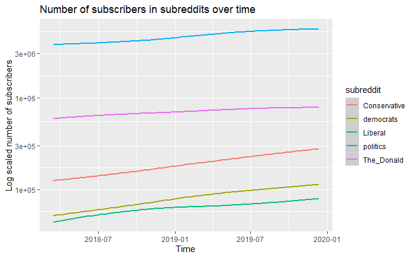

This plot shows similar trends to the previous one, apart from one noticeable difference that despite r/politics having fewer posts than r/The_Donald, they have far higher number of subscribers. This indicates that r/The_Donald has a smaller but far more active community.

One of the attributes of the posts are the scores, which are aggregated upvotes and downvotes for a post. It is an indicator of overall popularity of the post. We can take a look at distribution of the score for the different subreddits. This boxplot was created by ignoring outliers, as we found that there were outliers going way beyond the scale of the plot. 

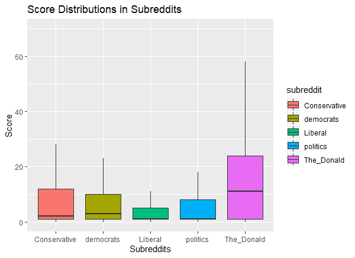

Now its time to take a look at the actual content of the posts. The simplest way to do this is using wordclouds. All the text processing was done using the `tm` package


#### Steps to create a wordcloud :-
1. Create a corpus out of the post titles
2. Cleaning steps such as converting to lower case, removing punctuation and stopwords.
3. Create a document term matrix using the word counts.
4. Create a wordcloud using the inbuilt function `wordcloud` in the library of the same name.

* Conservative - 

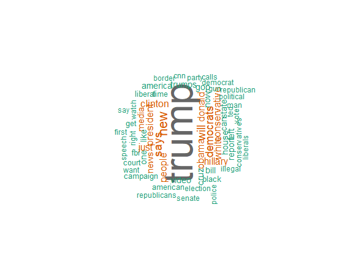

* Democrats - 

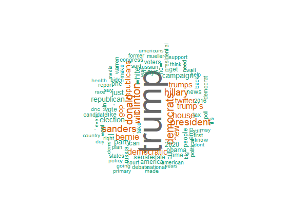

* Liberal - 

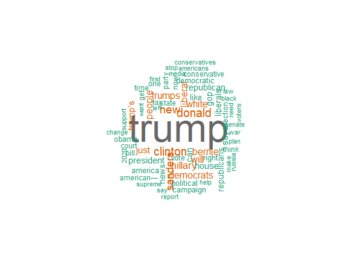

* Politics - 

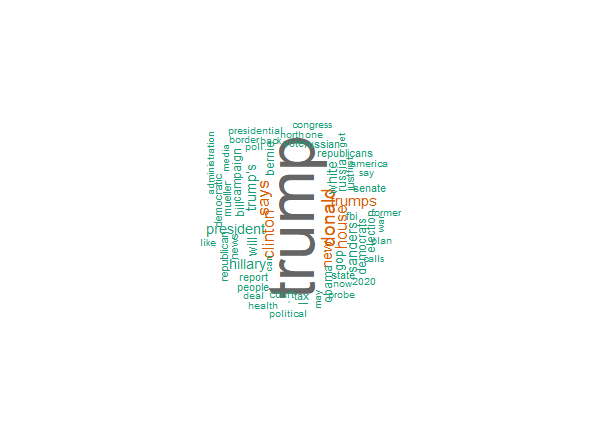

* The_Donald - 

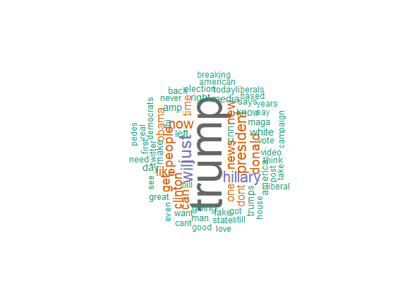


Unsurpringly, the most commonly talked about topic across all five subreddits is Trump, irrespective of their political leanings. Though a lot of the words are common across subreddits, we can see a lot more issue related terms in r/politics (nuclear, health, border) and a lot more descriptive terms in r/The_Donald (fake, great, good, love). 

The posts on political subreddits are often links to news articles and don't have much text content or discussion. Most of the discussion takes place in the comments, so let us turn our attention to that.

First, we ran a sentiment analysis model on all the comments in Python, using the `vader` package. We chose this model because it is a model that is attuned to sentiment analysis on social media, and has pretty good performance in terms of speed. The output of this model are four sentiment scores for each comment - positive, negative, and neutral sentiment scores (in terms of probabilities that add upto one), and a compund score, which is normalised between -1 (most negative sentiment), and +1 (most positive sentiment).

We found that this compound was pretty biased, so we used a threshold to classify a comment as positive, negative or neutral depwnding on the individual scores. Understandably, this resulted in most of the comments being classified as neutral, with a handful in the positive or negative categories. 

Before taking a look at the sentiments, here are the comment trends over time, mentioning different candidates in each subreddit.

* Conservative - 

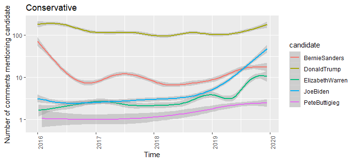

* Democrats - 

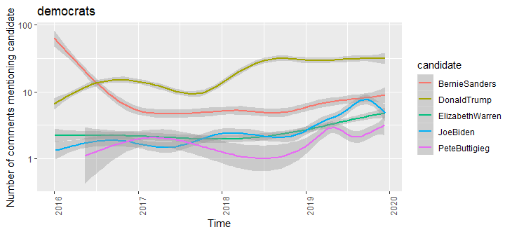

* Liberal - 

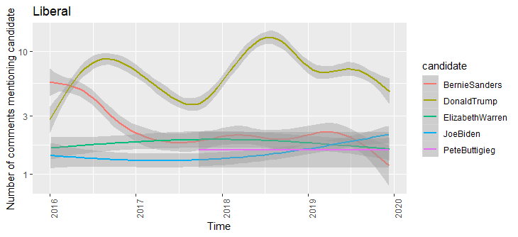

* Politics - 

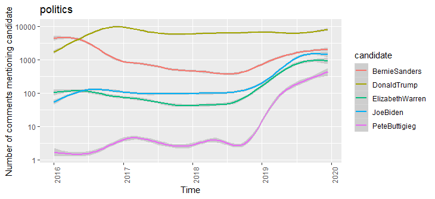

* The_Donald - 

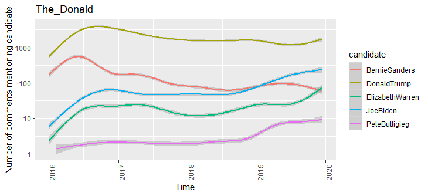

Across all subreddits, Bernie Sanders is discussed less over time, while Joe Biden is discussed more. We can also see that currently, r/politics discusses all five candidates to similar extents.

Now lets look at the proportion of positive and negative comments in each subreddit.

* Conservative - 

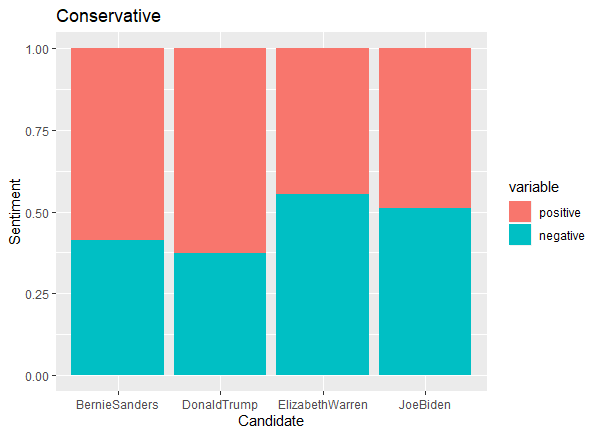

* Democrats - 

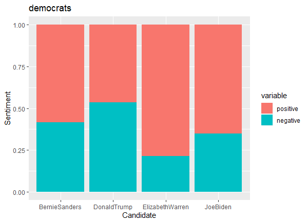

* Liberal - 

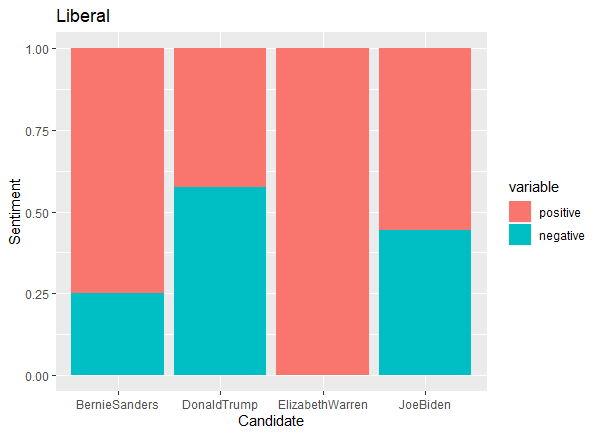

* Politics - 

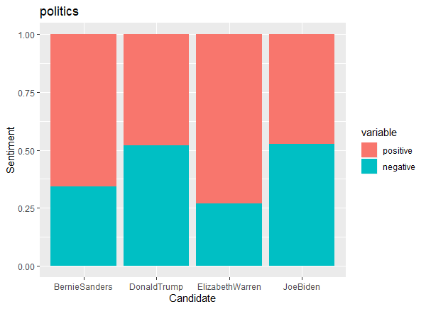

* The_Donald - 

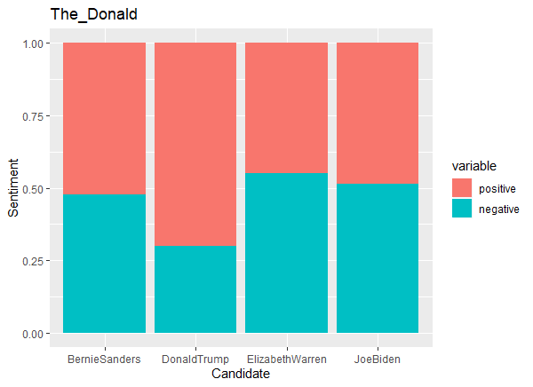

The only subreddits to talk about Donald Trump in a mostly positive light are r/conservatives and r/The_Donald, which is expected. Joe Biden seems pretty consistent across subreddits, with almost equally positive and negative sentiments. What is surprising is that r/politics talks about Biden with almost the same tones as they talk about Trump.

We created a parameter that is the ratio of positive to negative comments, so we can visualise how this changes across time.  

* Conservative - 

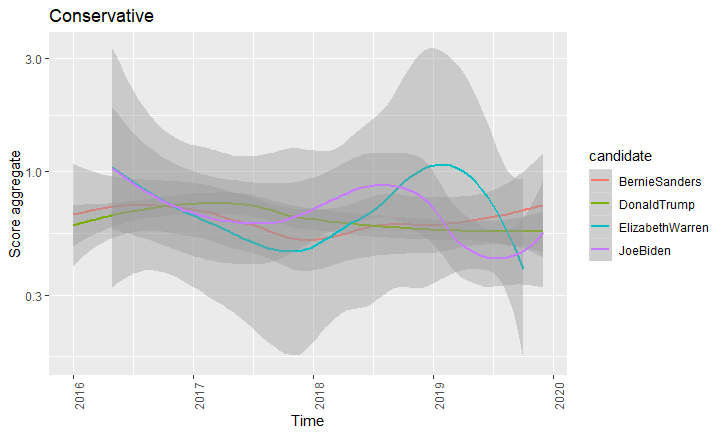

* Democrats - 

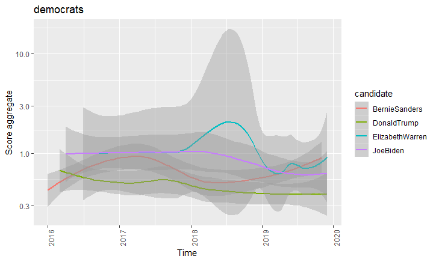

* Liberal - 

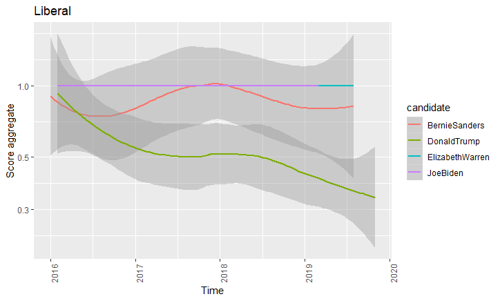

* Politics - 

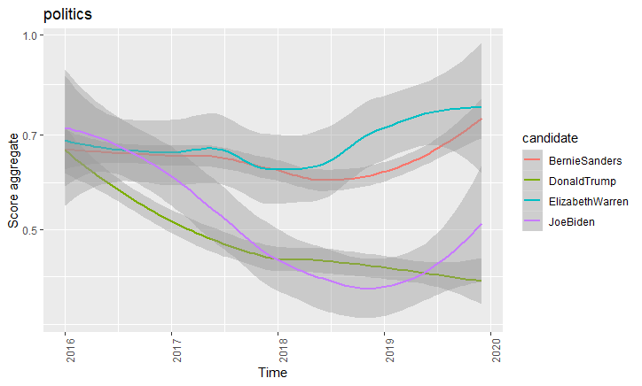

* The_Donald - 

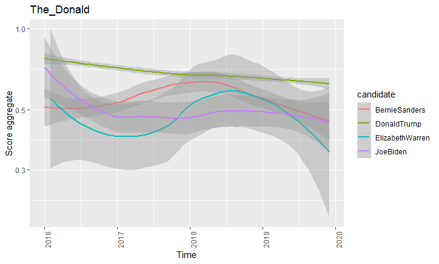

All the left leaning subreddits (r/politics, r/Liberal, r/democrats) are showing increased positive sentiments towards Elizabeth Warren. Donald Trump has shown decreasing positive sentiments in almost all subreddits, including r/The_Donald, which is interesting.

### Conclusions and key takeaways

Considering that r/politics is heavily left biased, a lot of the results were in line with expectations. Biden's apparent lack of popularity even in the blue subreddits was a bit surprising. Overall, Elizabeth Warren seems to be popular in these subreddits. Another surprising point was the decrease in Trump's popularity in the subreddit that is devoted to him. This is despite the fact that this subreddit is heavily censored, with most posts and comments criticising him being removed. 